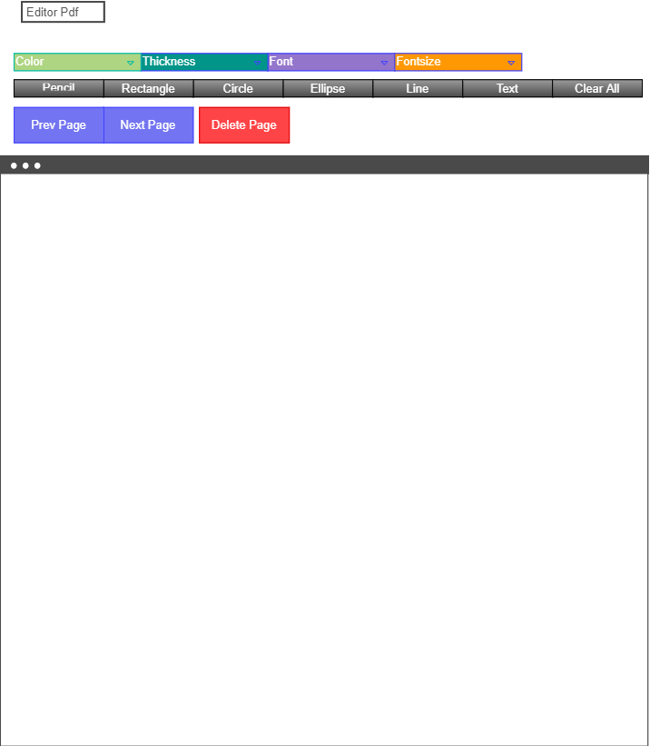
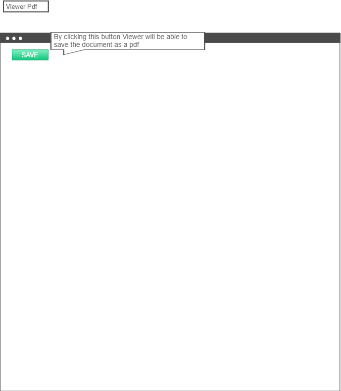

# Midterm Project: EasyDraw

**Team Members**: Earl Jay Caoile, Shubham Majumdar, Tammy Ip

## Project description

Our application allows two viewers to look at the same document on their own web browser, while one user is making changes on a document, those will be reflected on the other person’s browser simultaneously. Our drawing tool allows the user to create and manipulate lines, shapes, colors, and text to your documents.

### Links and Resources

*insert links and resources here*

### Documentation

*insert documentation here*

### Setup

*insert setup here*

### Tests

*insert testing here (probably just `npm test`)*

### UML

*insert UML diagram here*

### Wireframe

