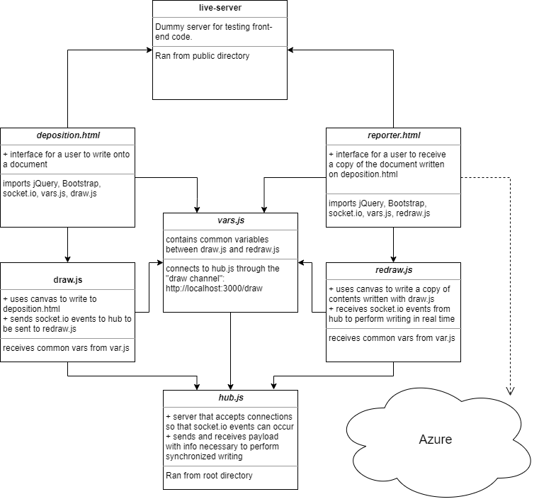

# Midterm Project: EasyDraw

**Team Members**: Earl Jay Caoile, Shubham Majumdar, Tammy Ip

## Project description

Our application allows two viewers to look at the same document on their own web browser, while one user is making changes on a document, those will be reflected on the other person’s browser simultaneously. Our drawing tool allows the user to create and manipulate lines, shapes, colors, and text to your documents.

### Links and Resources

_insert links and resources here_

### Documentation

- [Socket.IO Emit Cheatsheet](https://socket.io/docs/emit-cheatsheet/)
- [jQuery API](https://api.jquery.com/)
- [jsdPDF](http://raw.githack.com/MrRio/jsPDF/master/docs/)
- Various Stack Overflow resources:
  - [Erasing previously drawn lines on an HTML5 canvas](https://stackoverflow.com/questions/7365436/erasing-previously-drawn-lines-on-an-html5-canvas)
  - [Canvas jagged line issue](https://stackoverflow.com/questions/18836918/canvas-jagged-line-issue)
  - [What is pixel width and length for jspdf's default 'a4' format?](https://stackoverflow.com/questions/44757411/what-is-pixel-width-and-length-for-jspdfs-default-a4-format)
  - [Expanding a div's height when page scrolls down](https://stackoverflow.com/questions/38328697/expanding-a-divs-height-when-page-scrolls-down)

### Setup

Within Terminal/Git Bash:

1. From the main directory type `npm i` to install node modules
2. From the main directory, start the server with `nodemon hub.js`
3. Open another Terminal/Git Bash window, go to the public directory with `cd public`, and then start the live-server with `live-server`

### Tests

- Testing command: `npm test` from root directory

### UML

### Wireframe

